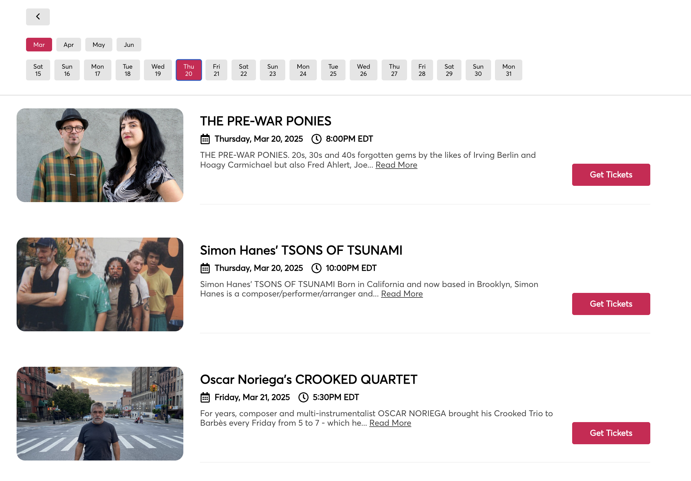
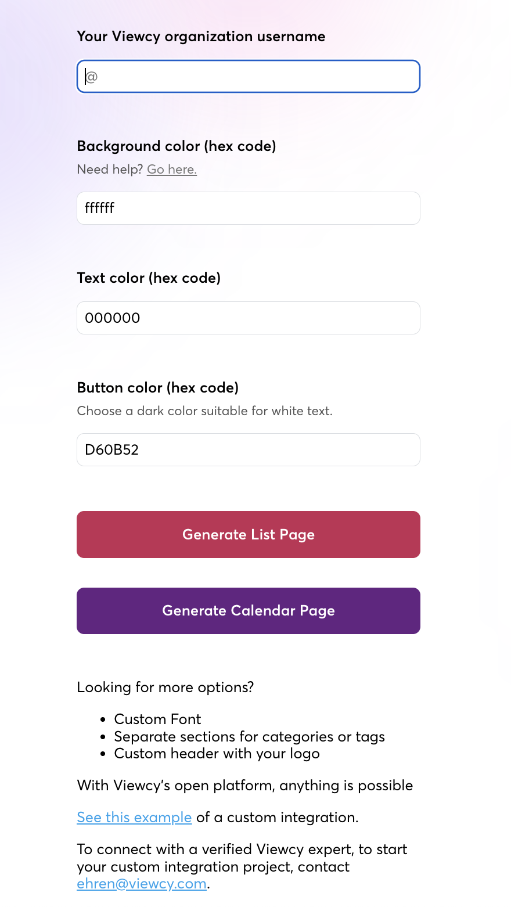

# ViewcyEmbed.com

A custom embeddable event listing solution built for [Viewcy](https://viewcy.com), enabling organizations to display their events in a seamless and customizable way.

## Features

-   **Customizable Design:** Organizations can modify background, text, and button colors to match their branding.
-   **List and Calendar Views:** Choose between a list format or a calendar-based event display.
-   **Easy Embedding:** Simple to integrate into any website with minimal setup.
-   **User-Friendly Interface:** Built for a smooth user experience when browsing and purchasing event tickets.

## Screenshots

### Event Listing Page

A sleek and modern event list that allows users to explore upcoming performances and buy tickets easily.

#### Calendar List Page

#### Event List Page

### Customization Panel

Admins can configure their event embeds with a simple UI, adjusting colors and styles.

## Deployment

The project is hosted at **[viewcyembed.com](https://viewcyembed.com)** and is actively used by Viewcy users for event embedding.
